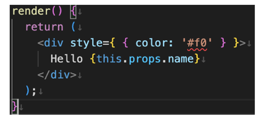

# Introduction

[eslint-plugin-css](https://www.npmjs.com/package/eslint-plugin-css) is an ESLint plugin that provides rules to verify CSS definition objects.

::: **WORKING IN PROGRESS** :::

## :name_badge: Features

This ESLint plugin provides linting rules to verify CSS definition objects.

- Find the wrong usage of CSS definition objects, and their hints.
- Support for Vue and JSX (React).
- Partial support for [styled-components] style objects.

You can check on the [Online DEMO](./playground/index.md).

[styled-components]: https://styled-components.com/docs/advanced#style-objects

## :question: Why is it ESLint plugin?

[Stylelint] partially supports CSS in JS, but some issues haven't been resolved for a long time.  
Also, CSS definitions using template literals are similar to CSS syntax, but CSS definitions using JavaScript objects are not. ESLint may work better for linting JavaScript objects.

[Stylelint]: https://stylelint.io

## :book: Usage

See [User Guide](./user-guide/index.md).

## :white_check_mark: Rules

See [Available Rules](./rules/index.md).

## :gear: Settings

See [Settings](./settings/index.md).

## :lock: License

See the [LICENSE](https://github.com/ota-meshi/eslint-plugin-css/blob/main/LICENSE) file for license rights and limitations (MIT).
